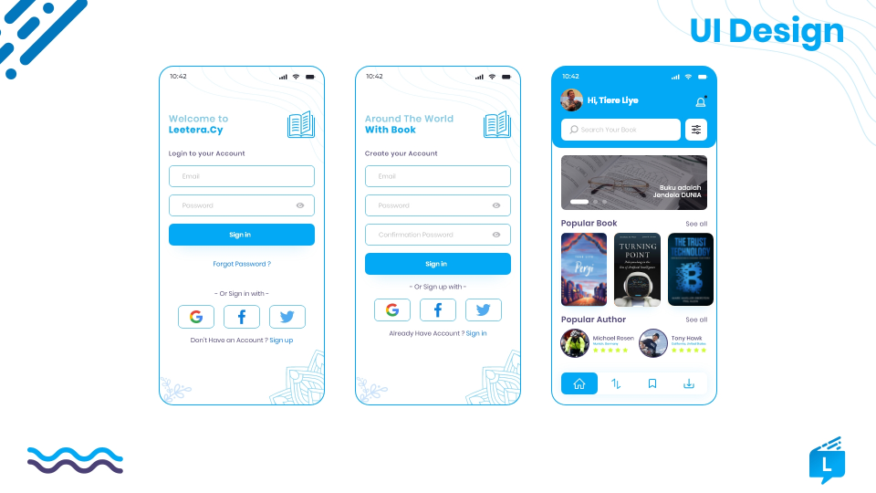

# Leetera.Cy
Leetera.Cy merupakan sebuah aplikasi berbasis mobile untuk para pembaca dalam mencari buku rekomendasi yang mengkhususkan pada katalogisasi buku

<h1>Konfigurasi Software:</h1>

  
1. Sistem Operasi Android 4.1 (Jelly Bean)

  
2. Bahasa Pemrograman Javascript dan JSON

  
3. Library React Native

  
4. Database Firebase

  
<h1>Kelompok</h1>

  
1. Aflah Mutsanni Pulungan - 171402012

  
2. Rizki Noprianita - 171402021

  
3. Eka Wulandari - 171402084

  
4. Arsil Nugraha - 171402087

  
5. Rio Aditya - 171402099

  
<h1>SCREENSHOOT</h1>

